# Z890M AORUS ELITE WIFI7 ICE Hackintosh EFI

OpenCore EFI configuration for GIGABYTE Z890M AORUS ELITE WIFI7 ICE motherboard.

## Hardware

- **CPU:** Intel Core Ultra 7 processor 270K Plus
- **Motherboard:** Z890M AORUS ELITE WIFI7 ICE
- **Cooling:** Deepcool LM240
- **Memory:**
	- Kingbank 48GB x2 DDR5 6400MHz (96GB)
	- KLEVV CRAS V RGB 64GB (32GB x2) DDR5 6400MHz
- **NVMe:** SAMSUNG 9100 PRO

## Directory Structure

### `/APPLE`
Apple-related utilities and firmware updaters.
- **UPDATERS/MULTIUPDATER/** - Firmware update tools (DpUtil, MultiUpdater)

### `/BOOT`
Boot configuration files.
- **BOOTx64.efi** - UEFI boot loader
- **BLC.plist** - Boot loading configuration

### `/oc`
OpenCore main configuration directory.

#### Configuration Files
- **config.plist** - Main OpenCore configuration
- **OpenCore.efi** - OpenCore bootloader

#### ACPI
ACPI patch files (SSDTs):
- **SSDT-EC.aml** - Embedded controller fix
- **SSDT-NVME-DISABLE.aml** - NVME device management
- **SSDT-PLUG-ALT.aml** - CPU power management
- **SSDT-PMC.aml** - Platform Management Controller
- **SSDT-RTCAWAC.aml** - RTC/AWAC compatibility
- **SSDT-SBUS-MCHC.aml** - SMBus controller
- **SSDT-USB-Reset.aml** - USB port reset
- **SSDT-USBX.aml** - USB power delivery

#### Drivers
OpenCore drivers:
- **OpenCanopy.efi** - Theme/GUI support
- **OpenHfsPlus.efi** - HFS+ filesystem driver
- **OpenRuntime.efi** - Runtime support
- **ResetNvramEntry.efi** - NVRAM reset utility

#### Kexts
Kernel extensions (device drivers):
- **AppleALC.kext** - Audio codec audio driver
- **AppleMCEReporterDisabler.kext** - Disables MCE reporting
- **CPUFriend.kext** - CPU power management
- **CPUFriendDataProvider.kext** - CPU data provider
- **CpuTopologyRebuild.kext** - CPU topology detection
- **GenericNVMeName.kext** - Generic NVME naming
- **itlwm.kext** - Intel WiFi driver
- **Lilu.kext** - Patching engine (required by many kexts)
- **LucyRTL8125Ethernet.kext** - Realtek 8125 ethernet
- **NootRX.kext** - GPU acceleration fixes
- **NullEthernet.kext** - Dummy ethernet for BIOS
- **NVMeFix.kext** - NVME compatibility fixes
- **RestrictEvents.kext** - Event restriction patches
- **SMC* kexts** - Virtual SMC and sensor monitoring
- **USBMap.kext** - USB port mapping
- **USBToolBox.kext** - USB tool
- **USBWakeFixup.kext** - USB wake fixes
- **VirtualSMC.kext** - Virtual SMC controller
- **XHCI-unsupported.kext** - Unsupported XHCI controller support

#### Resources
OpenCore UI and boot resources:
- **Font/** - UI fonts
- **Image/Acidanthera/** - Acidanthera branding images
- **Label/** - Boot entry labels (localization files)

## Usage

1. Copy the entire `efi/` folder to your EFI partition (FAT32): `/EFI/`
2. Configure BIOS settings according to your system requirements
3. Boot from OpenCore and select your macOS installation

## BIOS Settings Images

Reference BIOS screenshots:

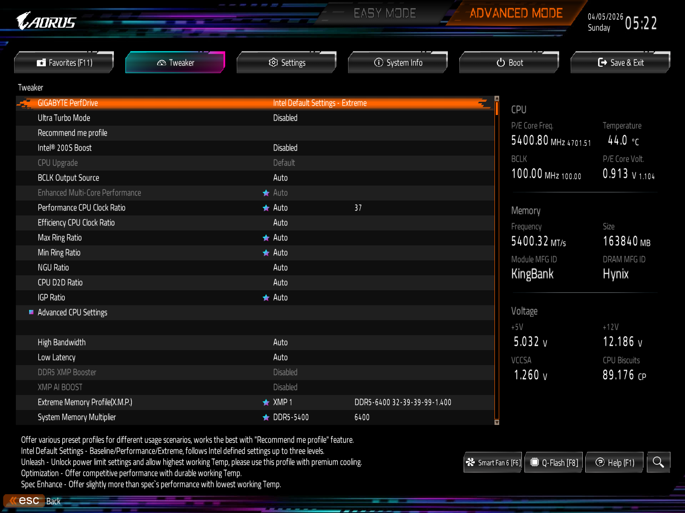
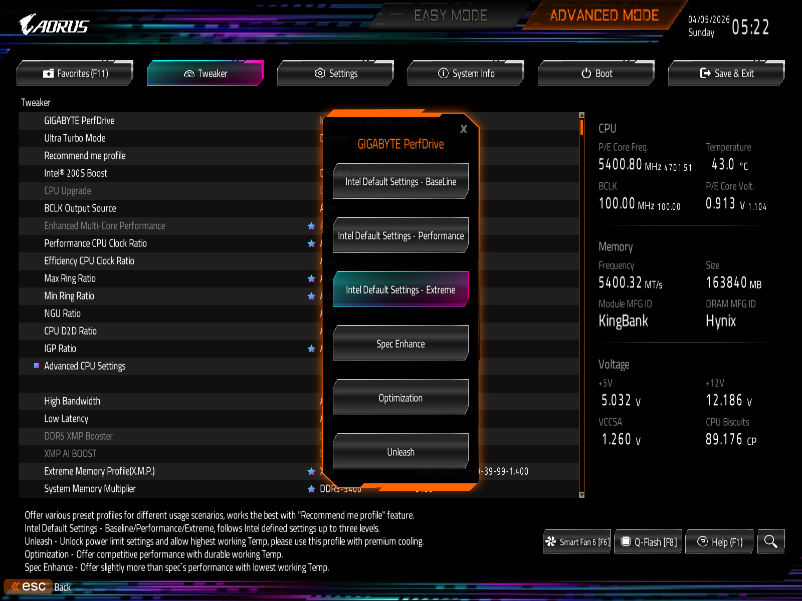
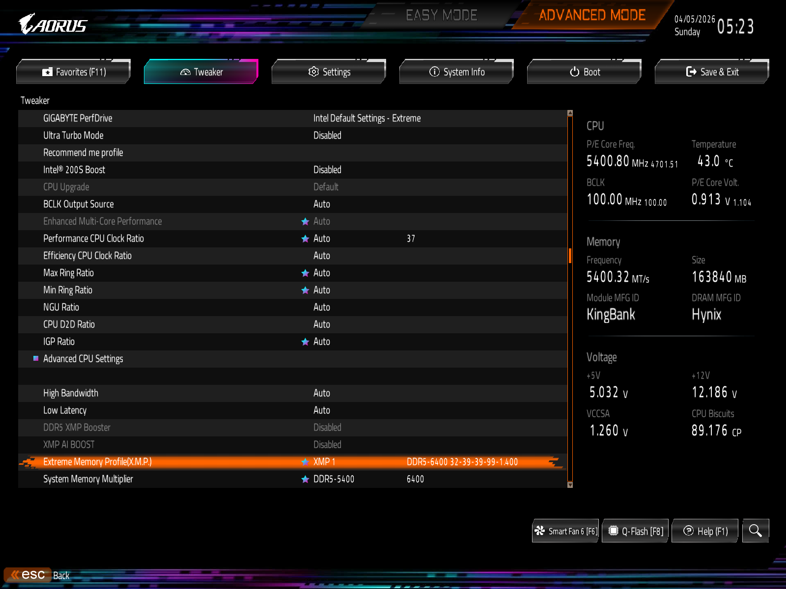
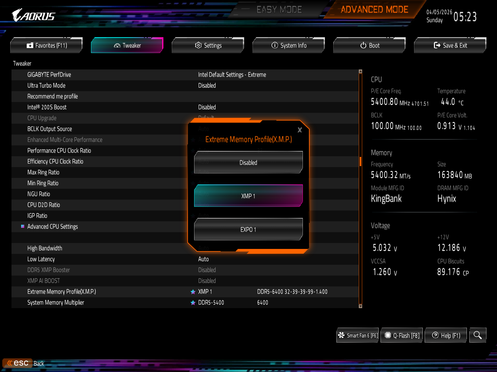
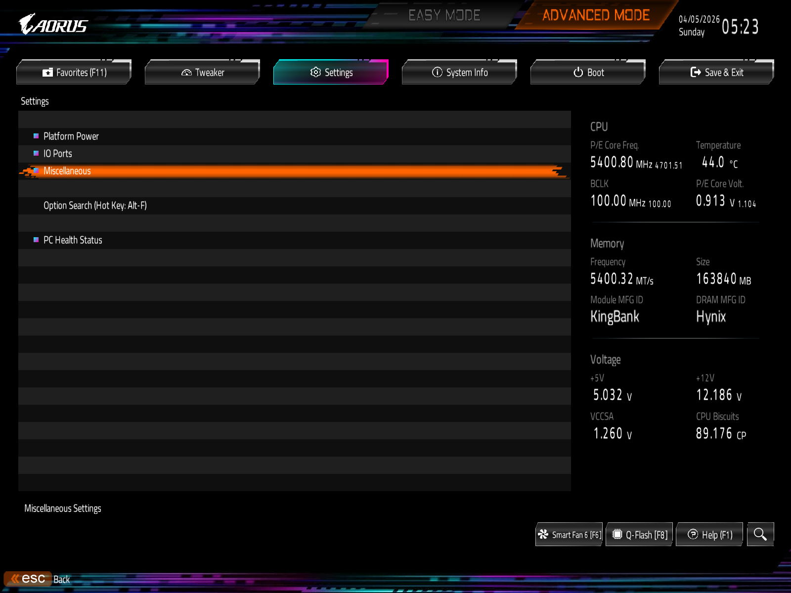
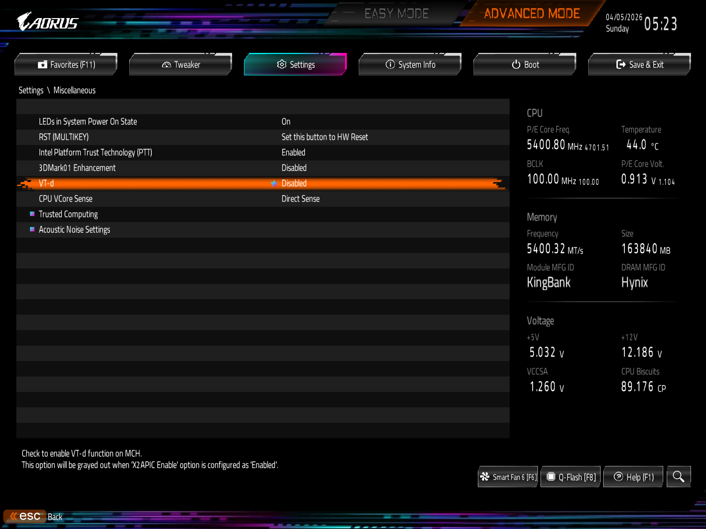
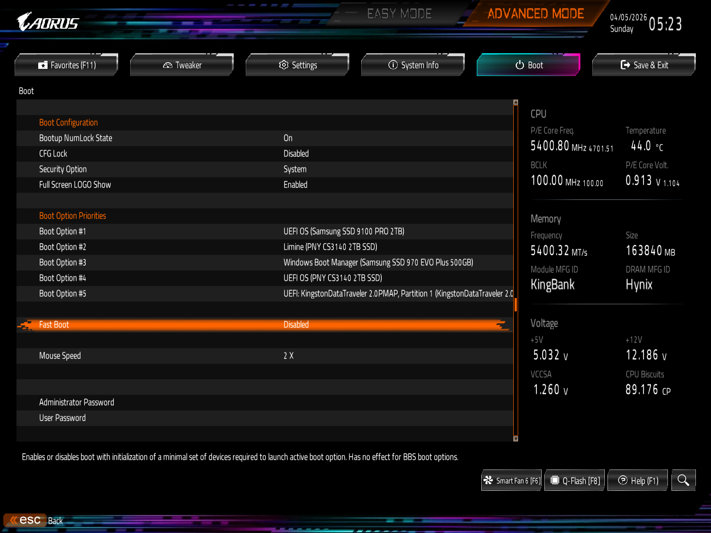
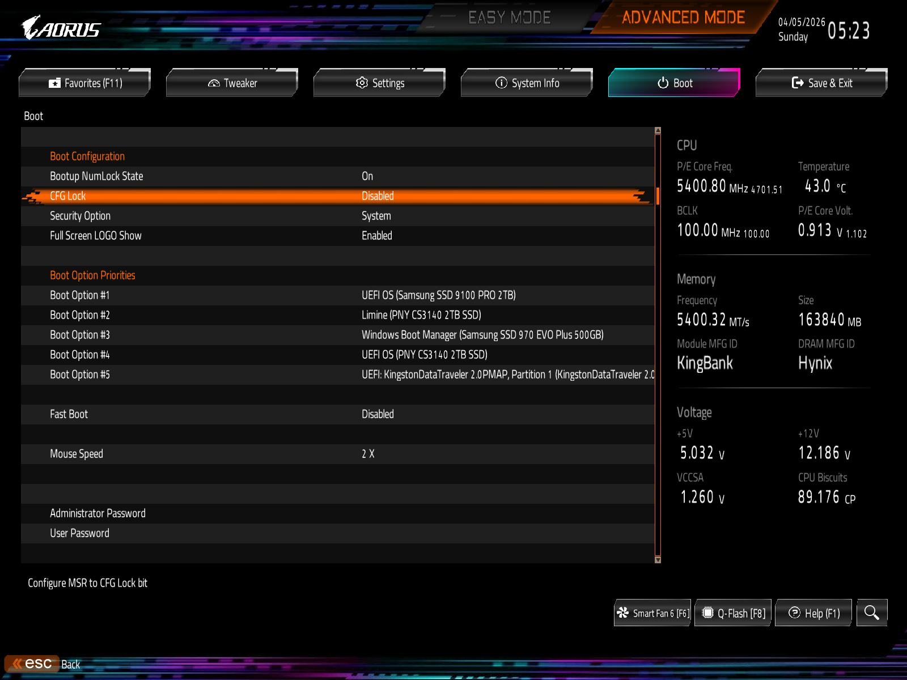
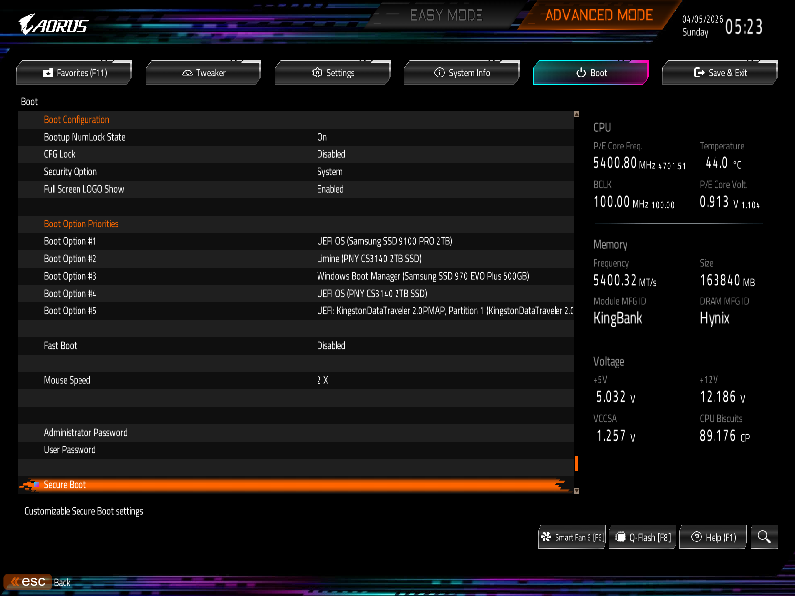
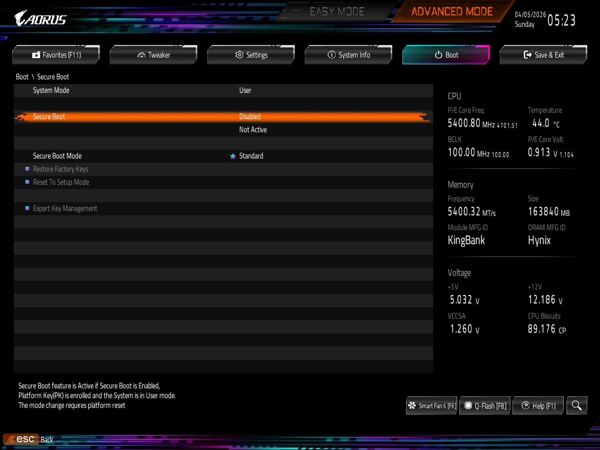
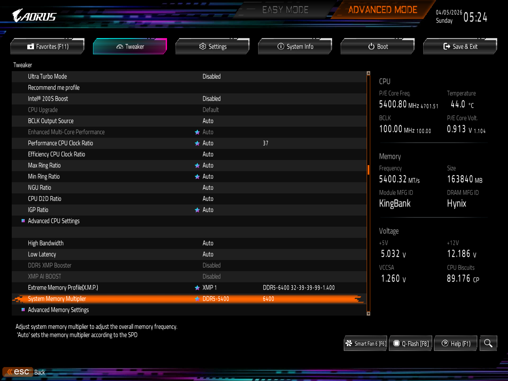
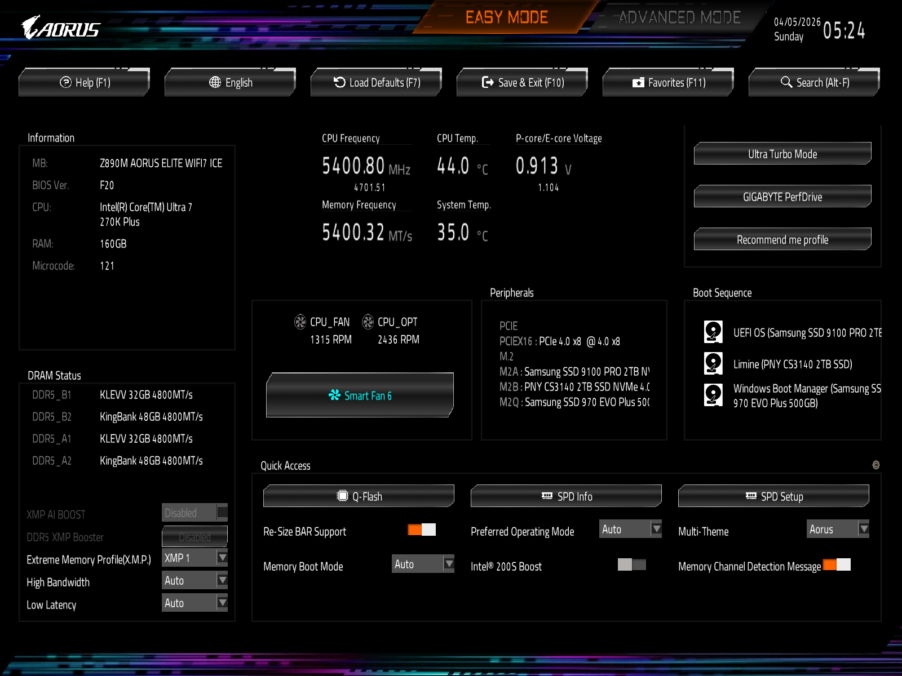

## Performance

### Cinebench R23

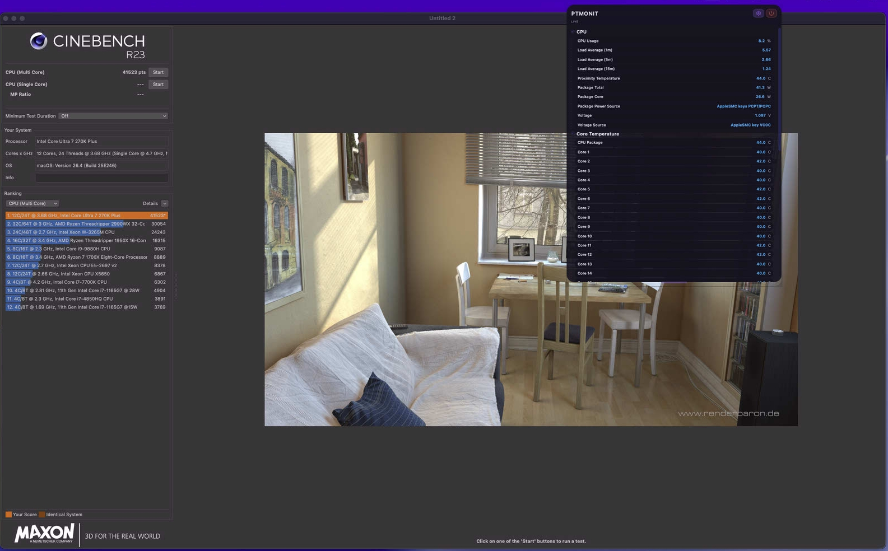

## Notes

- This configuration is specific to the Z890M AORUS ELITE WIFI7 ICE motherboard
- Customize `config.plist` for your specific hardware configuration
- Update kexts and drivers regularly
- Backup working configurations before making changes

## References

- [OpenCore Documentation](https://dortania.github.io/OpenCore-Install-Guide/)
- [OpenCore Legacy Patcher](https://dortania.github.io/OpenCore-Legacy-Patcher/)
